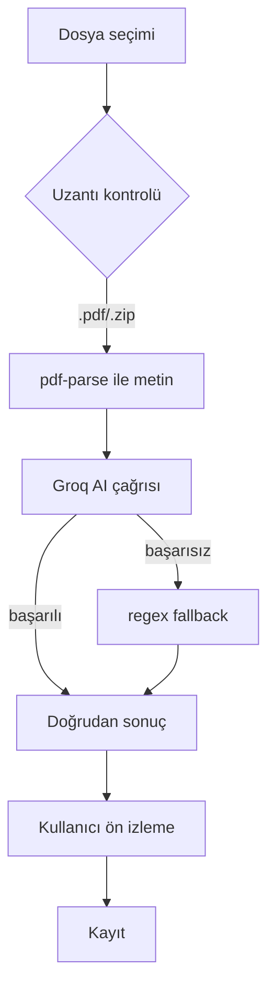

# KÖKLÜ ERP — Veri Bütünlüğü ve Fatura Parse Denetimi

> Tarih: 2026-07-31 · Branch: `main` · Kapsam: `src/**`, `db/**`
> Bu doküman kod okunarak üretilmiştir. Her bulgu dosya + satır ile kanıtlanmıştır.
> Hiçbir uzak veritabanında sorgu çalıştırılmamıştır.

---

## 0. Yönetici özeti

Beş bağımsız modülde **aynı mimari hata** bulundu: üst kayıt–kalem güncellemesi
"önce bütün kalemleri sil, sonra yeniden ekle" biçiminde, **transaction dışında**
yapılıyordu. Silme başarılı olup ekleme başarısız olduğunda (ağ kesintisi, RLS reddi,
validation hatası, sekmenin kapanması) kalemler kalıcı olarak kayboluyordu. Üç
modülde bu işlem **doğrudan tarayıcıdan** çalışıyordu, yani kullanıcının sekmeyi
kapatması tek başına veri kaybı için yeterliydi.

Fatura parse hattında ise: dosya türü yalnızca **dosya adına** bakılarak belirleniyor,
AI **tek doğruluk kaynağı** olarak kullanılıyor, UBL-TR XML hattı **hiç yok**, ve bir
yükleme ekranında JSON olmayan yanıt koşulsuz `response.json()` ile okunuyordu.

---

## 1. Üst kayıt–kalem risk matrisi

| Modül | Üst kayıt | Kalem tablosu | Transaction? | Önce silme? | Eksik payload siliyor mu? | Eşzamanlılık | Risk |
|---|---|---|---|---|---|---|---|
| Fiyat teklifi | `teklifler` | `teklif_kalemleri` | ❌ Yok | ✅ **Evet (istemciden)** | ✅ Evet | ❌ Yok | 🔴 **Kritik** |
| Servis formu | `service_forms` | `service_form_items` | ❌ Yok | ✅ **Evet (istemciden)** | ✅ Evet | ❌ Yok | 🔴 **Kritik** |
| Proforma | `proforma_faturalar` | `proforma_fatura_kalemleri` | ❌ Yok | ✅ **Evet (istemciden, hata kontrolsüz)** | ✅ Evet | ❌ Yok | 🔴 **Kritik** |
| Teslimat | `teslimatlar` | `teslimat_kalemleri` | ❌ Yok | ✅ Evet (sunucu) | ✅ Evet | ❌ Yok | 🔴 **Kritik** |
| Gelen/giden fatura (düzenleme) | `invoices` | `invoice_items`, `invoice_brokers` | ❌ Yok | ❌ Hayır (diff var) | ❌ Hayır | ❌ Yok | 🟡 Orta |
| Fatura (oluşturma) | `invoices` | `invoice_items` | ❌ Yok (telafi silme) | — | — | ❌ Yok | 🟡 Orta |
| Ön kayıt | `on_kayitlar` | JSONB `kalemler` kolonu | ✅ Tek satır | ❌ Hayır | ❌ Hayır | ❌ Yok | 🟢 Düşük |
| Teknik rapor → teklif | `teklifler` | `teklif_kalemleri` | ❌ Yok | ❌ Hayır (yeni kayıt) | — | — | 🟢 Düşük |
| Üretim emri / reçete | `uretim_emirleri` | `urun_receteler` | ❌ Yok | ❌ Hayır (satır bazlı CRUD) | ❌ Hayır | ❌ Yok | 🟢 Düşük |
| Tenant create (teklif/proforma/servis) | çeşitli | çeşitli | ❌ Yok (telafi silme) | — | — | — | 🟡 Orta |

---

## 2. Kanıtlanan kök nedenler

### 2.1 🔴 Fiyat teklifi — istemciden delete-then-insert

**Dosya:** `src/app/(dashboard)/fiyat-teklifleri/[id]/duzenle/DuzenleTeklifClient.tsx:275-281` (düzeltme öncesi)

```ts
const { error: delErr } = await supabase.from('teklif_kalemleri').delete().eq('teklif_id', teklif.id)
if (delErr) throw new Error(delErr.message)

const { error: kErr } = await supabase.from('teklif_kalemleri').insert(...)
```

**Çağrı zinciri:** `duzenle/page.tsx` → `DuzenleTeklifClient` → tarayıcıdaki Supabase
anon istemcisi → PostgREST.

**Kök neden:** İki bağımsız HTTP isteği. Aralarında transaction yok, geri alma yok,
üstelik istek **tarayıcıdan** gidiyor. `DELETE` 200 dönüp `INSERT` herhangi bir
nedenle başarısız olursa (RLS, ağ, sekme kapanması, validation) teklifin bütün
kalemleri kalıcı olarak gider. Üst kayıttaki `ara_toplam`/`genel_toplam` eski
değerinde kalır — bu yüzden kayıp listede hemen görünmez.

**İkincil kök neden (kimlik kaybı):** `page.tsx:22` gerçek `k.id` değerlerini
istemciye taşırken `DuzenleTeklifClient` bunları atıp
`id: Math.random().toString(36)` üretiyordu. Yani istemcinin kimlik bazlı diff
yapması **teknik olarak imkânsızdı**; delete-then-insert bir tasarım zorunluluğu
haline gelmişti.

**Veri kaybı:** Teklifin tüm kalemleri.

---

### 2.2 🔴 Servis formu — aynı desen + boş liste tuzağı

**Dosya:** `src/app/(dashboard)/service-forms/[id]/edit/EditServiceFormClient.tsx:96-128` (düzeltme öncesi)

```ts
const { error: delErr } = await supabase.from('service_form_items').delete().eq('service_form_id', id)
...
if (items.length > 0) {          // ← items boşsa hiçbir şey geri yazılmıyor
  const { error: insErr } = await supabase.from('service_form_items').insert(...)
}
```

**Kök neden:** 2.1 ile aynı. **Ek olarak** `items.length > 0` koşulu, boş listeyi
"bütün satırları sil" olarak yorumluyor. Form serialize hatası veya istemci render
problemi sonucu `items` boş kalırsa, kullanıcı hiçbir şey silmediği hâlde bütün cihaz
satırları gidiyor ve akış **hata bile vermiyor** — `router.push` ile başarı sayfasına
yönlendiriliyor.

**Veri kaybı:** Servis formundaki tüm cihaz satırları (seri no, gövde/valf/hortum/
manometre durumları dâhil).

---

### 2.3 🔴 Proforma — silme hatası hiç kontrol edilmiyor

**Dosya:** `src/app/(dashboard)/fiyat-teklifleri/proforma/ProformaFormClient.tsx:430` (düzeltme öncesi)

```ts
await supabase.from('proforma_fatura_kalemleri').delete().eq('proforma_id', proformaId)
//  ↑ dönüş değeri hiç okunmuyor: error sessizce yutuluyor
```

**Kök neden:** 2.1'in daha kötü hâli — `delete` çağrısının `error` alanı hiç
okunmuyor. Silme kısmen başarısız olsa bile akış devam ediyor ve `insert` mükerrer
kalem üretebiliyor.

**Ek bulgu:** `[id]/page.tsx:43` (düzeltme öncesi) kalem kimliğini
`Math.random().toString(36)` ile eziyordu — 2.1'deki kimlik kaybının aynısı.

---

### 2.4 🔴 Teslimat — sunucuda, ama yan etkileriyle birlikte

**Dosya:** `src/lib/teslimatlar.ts:702-748` (`updateTeslimat`)

```ts
await reverseExistingStock(id, mevcut.teslimat_no)          // ① stok geri alınır
await supabase.from('emanet_takipleri').delete()...          // ② emanet silinir
await supabase.from('geri_teslim_takipleri').delete()...     // ③ geri teslim silinir
await supabase.from('teslimat_kalemleri').delete()...        // ④ kalemler silinir
await supabase.from('teslimatlar').update(...)               // ⑤ üst kayıt
await supabase.from('teslimat_kalemleri').insert(...)        // ⑥ kalemler yeniden
```

**Kök neden:** Altı bağımsız yazma, tek transaction yok. ⑥ başarısız olursa yalnızca
kalemler değil, **emanet ve geri teslim takipleri de** kaybolur ve stok hareketleri
zaten geri alınmıştır. Bu modülde kayıp yalnızca kalem değil, **stok bakiyesi**
seviyesinde etki üretir.

**Not:** Bu akış bu görevde **düzeltilmedi** — bkz. §6 Kalan riskler.

---

### 2.5 🟡 Fatura düzenleme — diff var, atomiklik yok

**Dosya:** `src/app/(dashboard)/cari-hesap/faturalar/[id]/edit/actions.ts:115-162`

Bu akış doğru yaklaşımı kullanıyor (`itemsToDelete` / `itemsToUpdate` /
`itemsToInsert` ayrı ayrı geliyor), dolayısıyla **toplu silme riski yok**. Ancak:

- Yazmalar sıralı ve transaction dışında; ortada hata olursa fatura kısmen güncellenmiş kalır.
- **Silme ilk adımda** yapılıyor (satır 115) — kayıpsız sıra kuralına aykırı.
- `invoice_items` silme/güncelleme `eq('id', ...)` ile yapılıyor, `invoice_id` ile
  ikinci bir kısıt yok: başka faturaya ait bir kalem kimliği gönderilirse silinebilir.
  (Tenant kontrolü üst kayıt için var, kalem kimliği için yok.)

---

### 2.6 Ortak sonuç

Beş modülde aynı kod deseni kopyalanmıştı. Bu, tekil bir hata değil **mimari
boşluktu**: üst kayıt–kalem güncellemesi için ortak bir sözleşme ve tek bir uygulama
noktası yoktu.

---

## 3. Fatura yükleme ve parse hattı

### 3.1 Mevcut zincir



### 3.2 Bulgular

| # | Bulgu | Dosya | Etki |
|---|---|---|---|
| P1 | 🔴 JSON olmayan yanıt koşulsuz `res.json()` ile okunuyordu | `cari-hesap/faturalar/new/page.tsx:316` (önce) | 404 HTML sayfası ⇒ `Unexpected token '<' … is not valid JSON`. Kullanıcı gerçek hatayı hiç görmüyordu. |
| P2 | 🔴 Dosya türü **yalnızca uzantıdan** belirleniyor | `api/pdf-fatura-parse/route.ts:69-72` | `.pdf` adlı HTML/EXE içerik parse hattına giriyor. |
| P3 | 🔴 Dosya türü `file.type` (istemci beyanı) ile belirleniyor | `api/parse-fatura/route.ts:56-59` (önce) | Aynı sınıf; MIME istemciden geliyor. |
| P4 | 🔴 **UBL-TR XML hattı hiç yok** | tüm `src/**` | e-Fatura/e-Arşiv için deterministik kaynak kullanılmıyor. `api/efatura-import` bir XML parser değil, Excel satır importçusudur. |
| P5 | 🔴 ZIP içindeki XML **atılıyor** | `api/pdf-fatura-parse/route.ts:99` | `.filter(e => e.entryName.endsWith('.pdf'))` — e-Fatura paketindeki gömülü XML hiç okunmuyor. |
| P6 | 🔴 **AI tek doğruluk kaynağı** | `api/pdf-fatura-parse/route.ts:81-93` | AI önce çalışıyor, deterministik regex parser yalnızca AI patlarsa devreye giriyor. GOREV §7.2'nin tersi. |
| P7 | 🟠 Boyut limiti yok | `pdf-fatura-parse`, `gelen-pdf-parse` | ZIP tamamen belleğe alınıyor. |
| P8 | 🟠 Timeout yok | `parse-fatura` (önce), `pdf-fatura-parse` | AI çağrısı süresiz askıda kalabiliyor. |
| P9 | 🟠 Exception mesajı istemciye ham dönüyor | `pdf-fatura-parse/route.ts:115` | İç hata detayı sızabiliyor. |
| P10 | 🟠 Duplicate kontrolü tutar + VKN ile | `api/check-duplicate-invoice` | Fatura numarası normalizasyonu yok; farklı tedarikçilerin aynı numarası ayrıştırılmıyor. |
| P11 | 🟡 `scripts/parse_pdf.py`, `scripts/parse_teklif_pdf.py` repoda duruyor | `scripts/` | Artık hiçbir route çağırmıyor (Node'a taşınmış). Ölü kod; yanlış beklenti üretir. |

---

## 4. Şema / migration / tip uyumsuzlukları

| # | Bulgu | Kanıt | Durum |
|---|---|---|---|
| S1 | `proforma_fatura_kalemleri.firma_id` **yok** | `db/tenant_migration.sql` tablo listesinde `'proforma_kalemleri'` yazıyor — gerçek tablo adı `proforma_fatura_kalemleri` (`db/proforma_migration.sql:59`). `db/tenant_audit_checks.sql:19` bu drift'i zaten not etmiş. | Migration üretildi (apply edilmedi) |
| S2 | `teklifler` / `teklif_kalemleri` tablolarında `updated_at` **yok** | `db/teklifler_migration.sql:46,63` — yalnızca `created_at`. | Optimistic concurrency bu tablolarda çalışamaz; migration üretildi (apply edilmedi) |
| S3 | `service_forms` / `service_form_items` için **CREATE TABLE migration'ı repoda yok** | `db/staging_migration_inventory.md:23` | Şema kaynağı doğrulanmalı — kullanıcı kararı gerekiyor |
| S4 | Generated Supabase TypeScript tipi **yok** | `src/**` içinde `Database` tipi bulunamadı; tüm sorgular `any` üzerinden | Tip drift'i derleme zamanında yakalanamıyor |
| S5 | `teklifler.sube_id`, `genel_iskonto`, `genel_iskonto_tip` temel migration'da yok | `db/teklifler_migration.sql` vs `db/iskonto_migration.sql`, `db/subeler_migration.sql` | Ayrı ALTER migration'larıyla eklenmiş — sıra bağımlılığı dokümante edilmeli |

---

## 5. Uygulanan düzeltmeler

| Alan | Ne yapıldı | Dosya |
|---|---|---|
| Ortak sözleşme | Saf, bağımlılıksız diff motoru: eksik `lines` ⇒ koru, açık `deleteLineIds`, doğrulanmış `replaceAllLines`, `confirmDeleteAllLines`, yabancı kimlik reddi, kuruş bazlı para | `src/lib/aggregate/line-diff.ts` |
| Kayıpsız yazma sırası | üst kayıt → insert → update → **delete en son** | `line-diff.ts` (`applyLineDiffSafely`) |
| Tek uygulama noktası | Tenant doğrulama + concurrency + diff + yazma; modül tanımları tek yerde | `src/lib/aggregate/aggregate-update.ts` |
| Stabil endpoint | `POST /api/v1/aggregates/{module}/{id}` — Server Action yerine versiyonlu route | `src/app/api/v1/aggregates/[module]/[id]/route.ts` |
| JSON zarfı | `ApiSuccess`/`ApiFailure` + `readApiResponse` (önce status, sonra content-type) + `requestApi` (timeout/abort/network ayrı kod) | `src/lib/api/envelope.ts`, `src/lib/api/response.ts` |
| Idempotency | `Idempotency-Key` başlığı, process içi TTL store (kapsam sınırı dosyada yazılı) | `src/lib/api/idempotency.ts` |
| Teklif düzenleme | delete-then-insert kaldırıldı; `dbId` korunuyor; silme ayrı alanda | `DuzenleTeklifClient.tsx`, `duzenle/page.tsx` |
| Servis formu | Aynı; `items.length > 0` tuzağı kaldırıldı | `EditServiceFormClient.tsx`, `edit/page.tsx` |
| Proforma | Aynı; kontrolsüz `delete` kaldırıldı; `dbId` korunuyor | `ProformaFormClient.tsx`, `proforma/[id]/page.tsx` |
| P1 (JSON hatası) | Koşulsuz `res.json()` kaldırıldı | `cari-hesap/faturalar/new/page.tsx` |
| P3, P7, P8, P9 | Magic-bytes tür tespiti, boyut limiti, AI timeout, log/mesaj hijyeni | `api/parse-fatura/route.ts`, `src/lib/invoice-parse/file-acceptance.ts` |
| Normalizasyon | TR/EN sayı, para birimi, tarih, VKN/TCKN checksum, fatura no, toplam tutarlılığı | `src/lib/invoice-parse/normalization.ts` |
| P10 (duplicate) | `buildDuplicateKey` = düzenleyen VKN + normalize fatura no | `normalization.ts` |
| Faz D | `GET /api/v1/build-version` — eski sekme tespiti (otomatik reload yok) | `src/app/api/v1/build-version/route.ts` |
| Şema | `updated_at` + trigger, `proforma_fatura_kalemleri.firma_id`, idempotency tablosu, atomik RPC | `db/aggregate_atomic_update_rpc.sql` — **apply edilmedi** |
| Veri kaybı tespiti | Salt-okunur tespit sorguları | `db/read_only_possible_orphaned_or_missing_lines_audit.sql` |

---

## 6. Kalan riskler ve yapılmayanlar

| # | Konu | Neden yapılmadı | Sonraki adım |
|---|---|---|---|
| R1 | `updateTeslimat` hâlâ delete-then-insert | Stok/emanet/geri-teslim yan etkileriyle iç içe; güvenli dönüşüm gerçek transaction (RPC) gerektiriyor, RPC ise staging PASS bekliyor | Staging PASS sonrası RPC apply → `teslimatlar.ts` ortak sözleşmeye taşınır |
| R2 | Gerçek atomiklik yok | `db/aggregate_atomic_update_rpc.sql` apply edilmedi (staging NO-GO) | `.env.local` staging'e çevrilip `node scripts/verify-staging-env.mjs` exit 0 dönmeli |
| R3 | Optimistic concurrency yalnızca proforma'da aktif | `teklifler`/`service_forms` tablolarında `updated_at` yok | Migration apply → otomatik aktifleşir (kod capability-detect ediyor) |
| R4 | UBL-TR XML / OCR hattı yok | **Gerçek anonimleştirilmiş fatura örneği yok**; doğrulanamayan parser yazıp "destekleniyor" demek görev kısıtlarına aykırı | Kullanıcıdan anonimleştirilmiş örnek istenmeli (bkz. §7) |
| R5 | AI hâlâ birincil kaynak (`pdf-fatura-parse`) | Sıralamayı tersine çevirmek gerçek fatura fixture'ı olmadan regresyon riski taşır | Fixture geldikten sonra deterministik-önce sıralamaya geçilir |
| R6 | `invoice_items` silme/güncelleme `invoice_id` kısıtı taşımıyor | Fatura düzenleme akışı bu görevde ortak sözleşmeye taşınmadı | `AGGREGATE_MODULES` içine `invoice` modülü eklenerek çözülür |
| R7 | Generated DB tipi yok | Ayrı ve büyük bir iş | `supabase gen types typescript` akışı + CI drift kontrolü |
| R8 | Idempotency process içi | Kalıcı tablo apply edilmedi | R2 ile birlikte |

---

## 7. Kullanıcıdan gereken kararlar

1. **Parser fixture'ları:** text-layer PDF, taranmış PDF, UBL-TR XML, gömülü XML'li
   PDF, çok sayfalı fatura, iskonto/tevkifat içeren fatura — **anonimleştirilmiş**
   örnekler. Bunlar olmadan format desteği doğrulanmış sayılamaz.
2. **Staging env:** `.env.local` staging Supabase'e çevrilecek mi? RPC/migration apply
   ve gerçek atomiklik buna bağlı.
3. **`service_forms` şema kaynağı:** repoda CREATE TABLE migration'ı yok; şema nereden
   geldi?
4. **Resmi toplam kaynağı:** üst kayıttaki `genel_toplam` mı, kalemlerden hesaplanan
   toplam mı esas alınacak? (§7.5 toplam uyuşmazlığında kaydı engelleme kuralı buna bağlı.)
